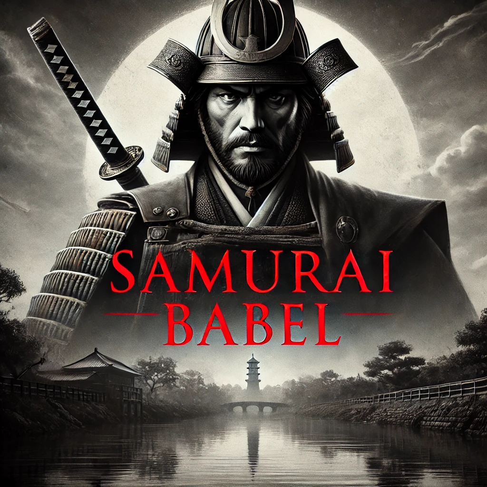

# Samurai Babel

# Samurai Babel

## Ekron Universe

In the heart of a world where ancient traditions meet futuristic visions, Samurai Babel unfolds as an epic saga of honour, adventure, and transformation.

This open-source RPG MMO transports players into a universe where the echoes of samurai battle resonate with the whispers of untold secrets.

## The World of Samurai Babel

The story is set in the sprawling realm of Babel, a land where majestic landscapes are dotted with ancient temples, bustling cities, and mysterious ruins.

Here, the old ways of the samurai coexist with emerging technologies, creating a rich tapestry of history and innovation. Players find themselves navigating this dynamic world, where every decision can alter the course of their journey and the fate of Babel itself.

## About the Game

"Samurai Babel" is an ongoing RPG and FPS game developed by Kreatyve Designs. It combines immersive storytelling, dynamic gameplay, and a unique blend of historical and futuristic elements to create an unforgettable gaming experience.

---

Enjoy the visual storytelling and gameplay of "Samurai Babel"!

## License

Feel free to use and adapt this image for personal or non-commercial projects. For commercial use, please contact the creator for permissions.

---
